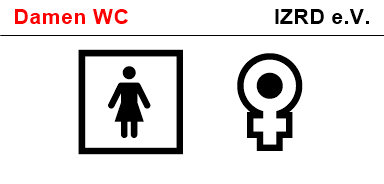

# 📺 OEPL Türschild-Projekt (PowerShell)

Dieses Projekt automatisiert die Erstellung und Anzeige von digitalen Türschildern auf **Hanshow Nebular E-Paper Displays** über **OpenEPaperLink (OEPL)**. Die Skripte sind in PowerShell geschrieben und erzeugen dynamisch Bilder auf Basis unterschiedlicher Datenquellen wie Microsoft 365 Kalendern, öffentlichen API-Diensten oder statischen Informationen.

---

## 🔧 Voraussetzungen

- Windows PowerShell
- .NET `System.Drawing` (standardmäßig vorhanden)
- Internetzugang für API-Zugriffe (Graph, DeepL, VBB)
- OEPL-Server mit angebundenem Display
- Schriftarten: Arial, Segoe UI (optional weitere installierbar)
- `tram.png` und `bus.png` (im gleichen Ordner für ÖPNV-Anzeige)
- ggf. `MSAL.PS` PowerShell-Modul (`Install-Module MSAL.PS`)

---

## 📦 Varianten

### 1. **Kalenderanzeige (Raum Horizont)**
Zeigt die heutigen Termine eines M365-Raumpostfachs an. Aktuelle Termine werden durch einen roten Rahmen hervorgehoben. Bei inhaltlicher Änderung wird automatisch ein neues Bild erzeugt und an OEPL gesendet.

**Datenquelle:** Microsoft Graph API  
**Besonderheiten:**
- Automatische Authentifizierung via Client Credentials
- Anzeige im Format: Uhrzeit + Titel
- Hashvergleich verhindert unnötige Updates
- Aktualisierung über geplanten Task

### 2. **Namensschild (Raum 3)**
Zeigt Namen von Teammitgliedern oder Zuständigen unterhalb des Raumnamens an. Zusätzlich kann eine **Abteilung** als roter Untertitel eingeblendet werden.

**Datenquelle:** statisch  
**Besonderheiten:**
- Layout wie bei anderen Türschildern
- Optionaler roter Subtitel (z.B. "Verwaltung")
- Kompakter Abstand zwischen Namen

### 3. **Zitat des Tages (Küche)**
Lädt ein zufälliges Zitat von `zenquotes.io`, übersetzt es automatisch via **DeepL API** ins Deutsche und zeigt es zentriert auf dem Display an.

**Datenquelle:** ZenQuotes.io + DeepL  
**Besonderheiten:**
- Zwei-zeiliges Zitat
- Zentrierte Darstellung
- Autor unter dem Zitat
- Nur bei neuem Zitat wird Bild aktualisiert

### 4. **WC-Beschilderung (Damen / Herren)**
Statische Schilder mit Unicode-Symbolen (🚺 / ♀ für Damen, 🚹 / ♂ für Herren). Die Symbole sind doppelt so groß wie normaler Text und zentriert dargestellt.

**Datenquelle:** statisch  
**Besonderheiten:**
- Einheitliches OEPL-Design
- Kein API-Zugriff nötig

### 5. **ÖPNV-Anzeige (Rathaus Lichtenberg)**
Zeigt die nächsten Abfahrten von Bussen und Trams der **BVG (VBB API v6)** für die Haltestelle *Rathaus Lichtenberg*. Symbole werden je nach Produkttyp automatisch geladen (`tram.png` / `bus.png`).

**Datenquelle:** [https://v6.bvg.transport.rest/](https://v6.bvg.transport.rest/)  
**Besonderheiten:**
- Gruppierung nach Linie & Richtung
- Anzeige mehrerer Abfahrtszeiten
- Bahnsymbol für Tram, Bus-Icon für Bus

---

## 🖼 Beispielbilder

| Typ                     | Vorschau                             |
|--------------------------|--------------------------------------|
| Kalender (Horizont)      |           |
| Namensschild (Raum 3)    |              |
| Zitat (Küche)            |             |
| WC Damen / Herren        |          |
| ÖPNV                    |               |

---

## 🧠 Struktur

Jede Variante ist als eigenes PowerShell-Skript realisiert. Beispiel:
- `OEPL_IZRD.ps1` – Raum Horizont (Kalender)
- `OEPL_IZRD_Raum3.ps1` – Raum 3 (Namen)
- `OEPL_IZRD_Kueche.ps1` – Küche (Zitat)
- `OEPL_IZRD_WC_Damen.ps1` – Damen-WC
- `OEPL_IZRD_WC_Herren.ps1` – Herren-WC
- `OEPL_IZRD_OePNV.ps1` – ÖPNV-Anzeige

---

## 📤 Upload an OEPL

Alle Skripte senden das fertige Bild per `curl` an den OEPL-Server:

```bash
curl.exe -X POST http://<OEPL-IP>/api/upload `
  -F "file=@<bilddatei>" `
  -F "id=<display_id>" `
  -H "accept: application/json"
